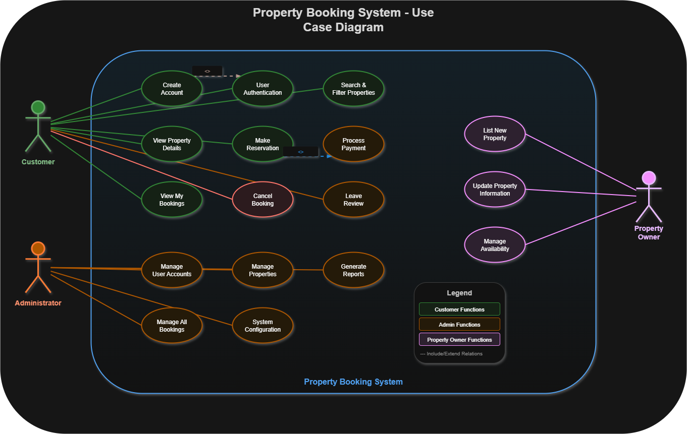

# Requirement Analysis in Software Development

This repository documents the Requirement Analysis phase for a Booking Management System. It covers the key concepts, activities, types of requirements, use case diagrams, and acceptance criteria, following industry-standard practices.

## What is Requirement Analysis?

Requirement Analysis is the process of identifying, documenting, and analyzing the needs and expectations of stakeholders for a software project. It ensures that developers clearly understand what the system should do, helping to prevent scope creep, reduce errors, and guide the design and implementation phases of the SDLC.

## Why is Requirement Analysis Important?

1. **Prevents Scope Creep:** Clearly defined requirements set project boundaries and reduce unexpected changes.  
2. **Ensures Stakeholder Alignment:** Confirms that the system meets business and user needs.  
3. **Guides Development & Testing:** Provides a roadmap for developers and testers, improving efficiency and reducing rework.

## Key Activities in Requirement Analysis

- **Requirement Gathering:** Collect information from stakeholders through interviews, surveys, and research.  
- **Requirement Elicitation:** Refine and elaborate on gathered requirements using brainstorming, prototyping, and workshops.  
- **Requirement Documentation:** Record requirements into structured documents and diagrams.  
- **Requirement Analysis & Modeling:** Analyze requirements for consistency, feasibility, and create models like use case diagrams.  
- **Requirement Validation:** Review requirements with stakeholders to ensure accuracy and completeness.

## Types of Requirements

### Functional Requirements
Functional requirements define what the system must do. Examples for a booking system:  
- User Registration  
- Property Search  
- Secure Login  
- Booking a Property

### Non-Functional Requirements
Non-functional requirements describe how the system should perform. Examples:  
- Page load time under 2 seconds  
- System must support 1000 concurrent users  
- Data encryption for sensitive information

## Use Case Diagrams

Use case diagrams visually represent interactions between users (actors) and the system. They help stakeholders understand system functionality and identify all user actions.

